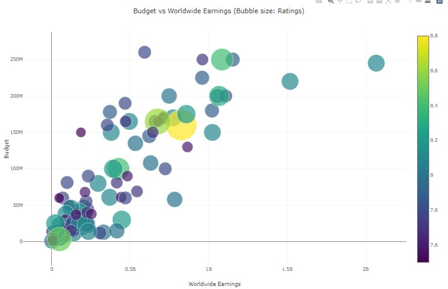
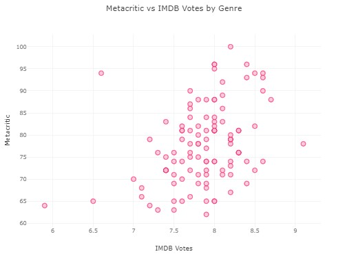
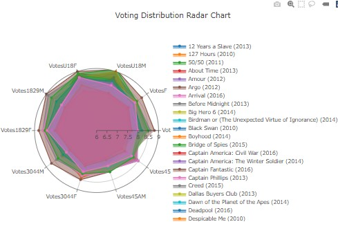
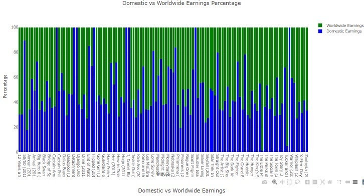

# **Project 3**

## **Overview:**

Our project, "Exploring Movie Data Analytics: Visualizing Ratings, Budgets, and Box Office Earnings," dives into the vast realm of movie data to uncover trends, preferences, and insights within the film industry. Through analysis of a comprehensive dataset sourced from Kaggle, we aim to visually represent movie ratings, budgets, box office earnings, and genre-related information. By incorporating interactive visualizations, we provide users with a dynamic platform to explore and understand various facets of the movie industry.

## **Instructions:**

To interact with our project, simply access the provided HTML file via a web browser. Upon loading, you'll find a series of interactive visualizations showcasing different aspects of movie data analytics. Utilize dropdown menus, hover-over tooltips, and interactive features to explore trends, compare metrics, and gain insights into movie ratings, budgets, and box office earnings across different genres.

## **Ethical Considerations:**

Throughout our project, ethical considerations, particularly regarding data privacy and representation, have been paramount. We've ensured that the dataset used is ethically sourced and adheres to guidelines. Additionally, we've strived to represent diverse perspectives within the movie industry, acknowledging the importance of inclusivity and fair representation in our analyses.

## **Data Sources:**

Kaggle Dataset: Movie Data Analytics Dataset [https://www.kaggle.com/datasets/shahjhanalam/movie-data-analytics-dataset]

## **Code References:**

SQLite Database File: [movie.sql]

## **File List:**

1. [main.ipynb] - Python for Data Extraction and Manipulation
2. [index.js] - JavaScript for Data Analysis and Visualization
3. [index.html] - HTML for Data Visualization
4. [output.json] - JSON Dataset Extracted for Manipulation   

## **Image Sources:**

1. Cover photo: [https://protocol-online.net/wp-content/uploads/2022/02/Untitled-design323.jpg]
2. Anime photo: [https://images5.fanpop.com/image/photos/31800000/Anime-anime-31854380-1800-1192.jpg]
2. Adventure photo: [https://wallpapercave.com/wp/wp2770636.png]
4. Various screenshots

## **Music Sources:

1. Adventure sound: [https://archive.org/details/TheLordOfTheRings_OST/TheLordOfTheRings_OST/Original_OST/1_The_Fellowship_of_the_Ring/18+-+May+It+Be.mp3]
2. Anime sound: [https://ia600904.us.archive.org/31/items/tvtunes_15377/Sailor%20Moon%20-%20Moonlight%20Densetsu%20-%20Long.mp3]
3. Anime sound: [https://ia800405.us.archive.org/6/items/07YomiNoSekaiShiToSeiNoAdaginTheWorldOf/Princess%20MONONOKE%20Soundtrack%20%5BMP3%5D/Princess%20MONONOKE%20Soundtrack%20%5BMP3%5D/32%20-%20Mononoke%20Hime%20%28Vocal%20Ending%29%20%28Princess%20Mononoke%20Theme%20Song%2C%20performed%20by%20Yosh....mp3]

## **Visualizations:**

Our project features a range of interactive visualizations, including but not limited to:

1. Budget vs. Box Office Earnings Bubble Chart

2. Metacritic vs. IMDb Ratings Scatter Plot

3. Voting Radar Chart

4. Domestic vs. Worldwide Box Office Earnings Stacked Bar Chart

These visualizations are tailored to provide insights into movie ratings, budgets, earnings, and genre-specific trends, enhancing understanding of the movie industry landscape.

# **Conclusion:**

Through our exploration of movie data analytics, we've unearthed valuable insights into industry trends, audience preferences, and the economic landscape of filmmaking. Leveraging interactive visualizations, we've crafted a user-friendly platform for exploring and understanding various facets of the movie industry. We hope our project ignites curiosity and fosters deeper insights into the captivating world of movies.

### **Copyright:**

T. Demetriou, K. Abeyakoon, D. Musa, K.J. Yong © 2024. All Rights Reserved.

